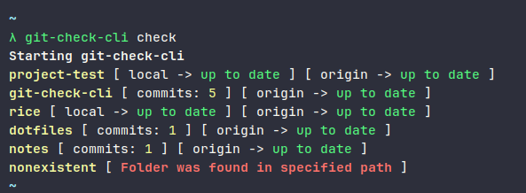
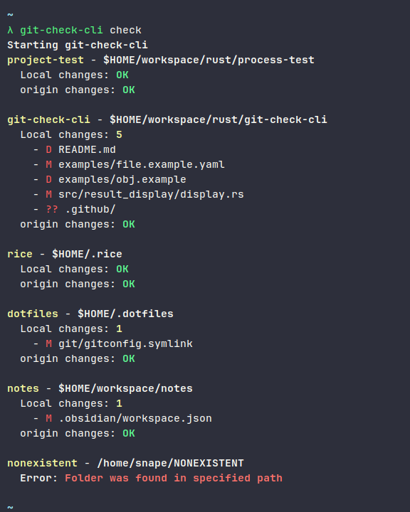

# git-check-cli

cli to help check and update git repos

<br/>

## Installation

To use this cli you will need to build it. First clone the project with this command

```sh
git clone https://github.com/brunoan99/git-check-cli
```

after **clonning the project** enter the project

```sh
cd git-check-cli
```

and then **build** with cargo:

```sh
cargo build --release --out-dir $PATH_TO_OUT
```

Its possible to use **'--out-dir $PATH_TO_OUT'** to build directly in the folder, like **'/usr/bin'**. Or just build the project and move the binary to some folder in your env **PATH** variable.

Before the build the repo folder will not be necessary, then can be deleted.

Create a config file **$HOME/.config/git-check-cli.yaml** follow this [example](./../examples/file.example.yaml)

<br/>

## Display Examples

**First Example** a short way to display info:

```yaml
config:
  - verbose: false
```



---

**Second Example** a verbose way to display info:

To get this style use in config file the option verbose or verbose: true, like:

```yaml
config:
  - verbose: true
```



<br/>

## Uninstall

To uninstall this cli remove the binary in the path that it was, to check it run:

```sh
which git-check-cli
```

<br/>

## Future

- [ ] Warning of BadInputs in yaml file
- [ ] if no command provided call a Selec to choose
- [ ] Cli options to Add, Remove, Change configs
- [ ] a setup option to generate file in place
- [ ] Install and Uninstall scripts
- [ ] doc for each feature

